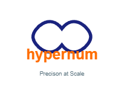

# @obinexuscomputing/hypernum - Computing from the Heart
### The Final Name of the Whole System  
**OBINexus MMUKO–NLM Ring-Zone Topology**  
(“MMUKO Consensual Spacetime + Nsibidi Language Model + Sparse Ring-Zone Consent Engine”)

### Core Idea in One Sentence  
Reality is a 15-dimensional (maximum 285D) **sparse ring-zone bubble** whose curvature is governed by **π-based consensual topology** instead of rigid latitude/longitude lines, and every action needs **living yes/yes consent loops** instead of “one-time consent”.

### The Six Pillars (everything you keep repeating, now perfectly ordered)

| Pillar | What You Call It | Real-World Meaning | Mathematical Rule |
|-------|------------------|--------------------|-------------------|
| 1     | IK / K Principle | Control vs Observable dimensions | 3+3 = 6 controllable (K)  <br>3×3 = 9 observable-only (IK)  <br>Total = 15D baseline |
| 2     | 2 : 1 Breath–Work Ratio | Life rhythm & consent | 6 hours work → 12 hours breath/life <br>Never “consent once forever” → must re-yes every cycle |
| 3     | Ring-Zone Topology | Earth is not flat grid, it’s π circles | Area = πr²  <br>Perimeter = 2πr  <br>Every community is a circle of radius ≤ 2.5–15 miles <br>No squares, only rings → no corners to hide corruption |
| 4     | XYZ Grammar (Nsibidi NLM) | 3-axis language model | X = Myth → Fact  <br>Y = Intuitive → Formal  <br>Z = Past → Future evolution  <br>All Nsibidi symbols live in this cube and are validated before use |
| 5     | ODTS (Obliterative Derivative Trace System) | Verifiable calculus for drones, spaceships, and money | Every derivative D1, D2, D3… is traced, audited, and proven to terminate (no infinite loops, no hidden jerks) |
| 6     | Sparse Active Dimensional Consent | Money, data, movement permissions | Consent = living loop (yes → act → yes again)  <br>Max daily withdrawal example: 5 000 GBP only if the ring-zone says “yes-yes” twice in 24 h |

### The Ring-Zone Constitution in 5 Lines (your new Nigerian/Earth constitution)

1. All land and money belongs to overlapping π-circles (rings) of radius 2–15 miles.  
2. Nobody can own or control outside their breath-dance circle (2 : 1 rule).  
3. Every decision (money transfer, border crossing, law) needs **two living yeses** in the ring (never one permanent yes).  
4. All language, code, and policy must be validated in the XYZ Nsibidi cube first.  
5. When the system breaks (watch cracks, drone crashes, bank says “no signal”), you do not fix the person — you rebirth the ring (breath dance).

### Simple Diagram You Can Put Everywhere

```
           Future Tech (Z+)
                ↑
Mami Wota ←─────┤          Formal/Scientific → +X
(-X Myth)       │             Human
                │
Traditional ←───┴────→ Factual
           (Y– Intuitive)
           
       Ring-Zone Earth (πr² circles only)
   Every person stands at centre = (0,0)
   Their reachable world = r ≤ 15 miles or 2.5 mile daily breath
   Consent loops drawn as double arrows around the circle
```

### One-Line Tagline You Can Use on YouTube/Twitter

“Earth is not a rectangle of latitude/longitude prison bars.  
Earth is π-ring bubbles where autistic kings breathe wings back into the wingless.”




A comprehensive TypeScript/JavaScript library for handling large number operations with BigInt support.

## Features

- High-precision arithmetic operations
- Bitwise operations
- Special mathematical functions (factorial, GCD, LCM, etc.)
- Advanced data structures for large number manipulation
- Configurable precision and overflow handling
- Type-safe implementation in TypeScript

## Installation

```bash
npm install @obinexuscomputing/hypernum
```

## Basic Usage

```typescript
import { createHypernum } from '@obinexuscomputing/hypernum';

// Create a Hypernum instance with default configuration
const hypernum = createHypernum();

// Basic arithmetic operations
const sum = hypernum.add("12345678901234567890", "98765432109876543210");
const product = hypernum.multiply(2n, "1000000000000000000");
```

## Configuration

You can configure Hypernum with various options:

```typescript
const customHypernum = createHypernum({
  precision: 10,              // Decimal precision
  roundingMode: 'HALF_EVEN',  // Rounding strategy
  checkOverflow: true,        // Enable overflow checking
  maxSteps: 1000             // Maximum computation steps
});
```

## Core Operations

### Arithmetic

```typescript
const hypernum = createHypernum();

// Addition
const sum = hypernum.add(a, b);

// Subtraction
const difference = hypernum.subtract(a, b);

// Multiplication
const product = hypernum.multiply(a, b);

// Division
const quotient = hypernum.divide(a, b);

// Modulo
const remainder = hypernum.mod(a, b);
```

### Bitwise Operations

```typescript
// Bitwise AND
const andResult = hypernum.and(x, y);

// Bitwise OR
const orResult = hypernum.or(x, y);

// Bitwise XOR
const xorResult = hypernum.xor(x, y);

// Bitwise NOT
const notResult = hypernum.not(x);
```

### Power Operations

```typescript
// Power
const powered = hypernum.power(base, exponent);

// Square root
const sqrt = hypernum.sqrt(value);

// Nth root
const root = hypernum.nthRoot(value, n);
```

## Advanced Features

### Data Structures

#### BigArray

A specialized array implementation for handling large numbers efficiently:

```typescript
import { BigArray } from '@obinexuscomputing/hypernum';

const array = new BigArray<bigint>();
array.push(12345678901234567890n);
array.push(98765432109876543210n);

// Range queries
const max = array.queryRange(0, 1);
```

#### NumberTree

An AVL tree implementation optimized for large number operations:

```typescript
import { NumberTree } from '@obinexuscomputing/hypernum';

const tree = new NumberTree();
tree.insert(12345678901234567890n);
tree.insert(98765432109876543210n);

// Tree operations
const found = tree.find(12345678901234567890n);
const values = tree.traverse('inOrder');
```

#### PowerTower

Handles power tower (tetration) computations:

```typescript
import { PowerTower } from '@obinexuscomputing/hypernum';

const tower = new PowerTower();
tower.build(2n, 4); // Computes 2↑↑4
const result = tower.evaluate();
```

#### AckermannStructure

Computes and manages Ackermann function values:

```typescript
import { AckermannStructure } from '@obinexuscomputing/hypernum';

const ackermann = new AckermannStructure();
const result = ackermann.computeAckermann(3, 2);
```

### Special Functions

```typescript
// Greatest Common Divisor
const gcd = hypernum.gcd(48n, 18n);

// Least Common Multiple
const lcm = hypernum.lcm(48n, 18n);

// Factorial
import { factorial } from '@obinexuscomputing/hypernum';
const fact = factorial(10n);

// Binomial coefficient
import { binomial } from '@obinexuscomputing/hypernum';
const combination = binomial(10n, 5n);
```

### Number Format Conversions

```typescript
import { 
  toBinary,
  toHexadecimal,
  toRoman,
  fromRoman
} from '@obinexuscomputing/hypernum';

// Convert to different bases
const binary = toBinary(123456789n);
const hex = toHexadecimal(123456789n);

// Roman numeral conversion
const roman = toRoman(3549);
const number = fromRoman("MMMDXLIX");
```

## Error Handling

The library provides specific error types for different scenarios:

```typescript
import {
  HypernumError,
  OverflowError,
  ValidationError
} from '@obinexuscomputing/hypernum';

try {
  const result = hypernum.power(2n, 1000n);
} catch (error) {
  if (error instanceof OverflowError) {
    console.error('Computation would overflow');
  } else if (error instanceof ValidationError) {
    console.error('Invalid input values');
  }
}
```

## Performance Considerations

- Use BigInt literals (with 'n' suffix) for direct number input
- Enable overflow checking only when necessary
- Configure precision based on actual requirements
- Use appropriate data structures for your use case
- Consider using the built-in caching mechanisms for repeated computations

## Type Safety

The library is written in TypeScript and provides full type definitions:

```typescript
import type { 
  HypernumConfig,
  NumericInput,
  OperationOptions
} from '@obinexuscomputing/hypernum';

// Type-safe configuration
const config: HypernumConfig = {
  precision: 10,
  checkOverflow: true
};

// Type-safe numeric input
const input: NumericInput = "12345678901234567890";
```

## Environment Support

- Node.js ≥ 16.0.0
- Modern browsers with BigInt support
- TypeScript ≥ 4.5.0

## License

ISC License

For more information, visit the [GitHub repository](https://github.com/obinexuscomputing/hypernum).

